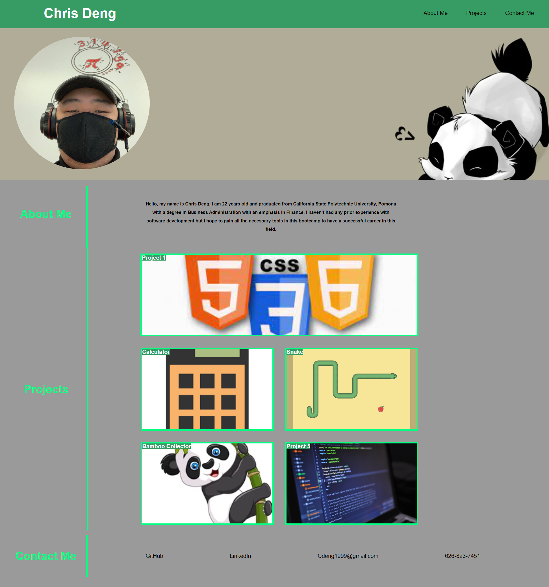

# personal-portfolio

## Description

The purpose of this project was to create a portfolio that highlights the projects you have completed. I was able to create and design the website with links that jump to certain sections on the page as well as links that direct you to my Github or LinkedIn.

## To Do

As I work on more projects I will replace the placeholder projects I have with projects I have completed and feel confident in. I also have to work on making the page more responsive as well as continue to style the page. I want to also add more complex stylistic effects once I get more comfortable with Javascript.

## Links
[This is a link to the repository](https://github.com/ChrisDeng1999/personal-portfolio)

[This is a link to the website](https://chrisdeng1999.github.io/personal-portfolio/)

## Technologies
* HTML
* CSS

## Screenshot
